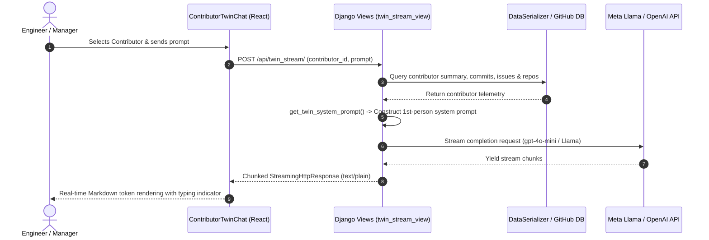

# OrgLens — Codebase Intelligence & Expert Discovery

[](https://react.dev/)
[](https://www.djangoproject.com/)
[](https://llama.meta.com/)
[](LICENSE)

https://github.com/user-attachments/assets/7496afda-b3e3-4e1d-b03f-ddc43982b7a1

OrgLens is an intelligent developer portal designed to eliminate tribal knowledge silos across engineering organizations. By indexing repository commit graphs, pull requests, issue threads, and contributor activity, OrgLens gives teams instant visibility into who owns what and enables real-time interaction with developer **Digital Twins**.

---

## 💡 The Problem & Our Approach

### The Challenge
In scaling engineering teams, institutional knowledge gets buried across hundreds of commit histories, pull requests, and fragmented documentation. Onboarding engineers spend weeks figuring out who built a specific service or why an architectural decision was made.

### The OrgLens Solution
OrgLens ingests git telemetry across your GitHub organization, builds an interactive force-directed graph of contributor-repository relationships, and deploys **Digital Twins**—AI personas modeled on each developer's actual code contributions—allowing you to ask technical questions asynchronously.

## Core Features

✨ **AI-Powered Contributor Summaries & Profiles**.
🔍 **Natural Language Codebase Querying**.
🌐 **Repository & Contributor Exploration**.
🤖 **"Digital Twin" Interaction via Chat**.

---

## 🤖 Digital Twin Architecture

OrgLens introduces **Digital Twins**—autonomous AI personas synthesized for every software engineer in your organization based on their real commit history, pull requests, issue resolutions, and repository activity.

### ⚙️ Backend API & Prompt Pipeline Specification

The Digital Twin feature is powered by Django REST endpoints that dynamically build persona system prompts and stream responses using chunked transfer encoding (`StreamingHttpResponse`).

#### 1. Endpoint Details
* **Route**: `POST /api/twin_stream/`
* **Content-Type**: `application/json`
* **Request Payload**:
  ```json
  {
    "contributor_id": 1,
    "prompt": "What was your approach to optimizing the React rendering pipeline?"
  }
  ```
* **Response Header**: `Content-Type: text/plain; charset=utf-8` (chunked HTTP stream)

#### 2. Dynamic System Persona Construction
When a user initiates a chat session, the backend gathers relevant contextual telemetry:
1. **Contributor Profile & Overview**: Pulls overall contribution summaries from `DataSerializer`.
2. **Repository Mapping**: Links contributor activity with specific repositories and summaries.
3. **Commit & Issue History**: Ingests recent commit messages, solved GitHub issues, and PR context.
4. **Persona Framing**: Enforces first-person persona execution ("I built...", "In my recent commit...").

#### 3. Frontend Chat Component (`ContributorTwinChat.jsx`)
* **Floating Widget Integration**: Embedded inside [ContributorDetail.jsx](file:///Users/apple/Desktop/llama/frontend/src/pages/ContributorDetail.jsx) with fixed bottom-right positioning.
* **Readable Streams Handler**: Uses standard Fetch API `response.body.getReader()` with `TextDecoder` to stream markdown text tokens in real time.
* **Interactive Prompt Chips**: Quick action buttons allow users to send predefined queries instantly.
* **Responsive Dark/Light Layout**: Full Tailwind CSS adaptation matching global theme state.

#### 4. End-to-End Execution Flow



#### 5. Privacy, Security & Fallback Mechanics
* **Data Privacy**: Telemetry passed to the Digital Twin prompt includes only public/authorized repository commit metadata and issue summaries within the organization.
* **Graceful Degradation**: If an LLM provider key (`OPENAI_API_KEY` or `LLAMA_API_KEY`) is offline, the backend stream generator yields a pre-formatted fallback response without throwing a 500 error.
* **Persona Boundaries**: The twin is strictly scoped to the engineer's domain. Queries outside their contribution scope trigger automatic referral to the relevant repository owner.

---

## 🛠 Troubleshooting & Common FAQs

| Issue | Root Cause | Solution |
| :--- | :--- | :--- |
| **CORS Blocked on Stream** | Missing Origin Headers | Verify `CORS_ALLOW_ALL_ORIGINS = True` or add frontend URL to `CORS_ALLOWED_ORIGINS` in `settings.py`. |
| **Streaming Response Delayed** | Reverse Proxy Buffering | Set `X-Accel-Buffering: no` in server response headers and disable proxy buffering in Nginx/Render. |
| **404 Contributor Not Found** | Unmatched ID | Ensure `contributor_id` passed in request payload matches string or integer primary key in DB. |
| **OpenAI / Llama Rate Limit** | Exhausted API Quota | Backend automatically triggers fallback streaming generator; update `.env` API keys. |


## 🛠 Tech Stack

| Component | Technology |
|---|---|
| **Backend** | Python, Django, Llama API |
| **Frontend** | ReactJS, Vite, Tailwind CSS |
| **Data APIs** | GitHub API |
| **Real-time Voice/Chat** | PlayAI API powered by Groq |


## 🚀 Getting Started

### Prerequisites
- Python 3.10+
- Node.js 18+
- Git

### Installation
1.  **Clone the repository:**
    ```bash
    git clone https://github.com/rajneeshverma1/Hack-e-awadh
    cd Hack-e-awadh
    ```
2.  **Set up the Backend (Django Server):**
    ```bash
    cd backend
    python -m venv venv
    source venv/bin/activate  # Use `.\venv\Scripts\activate` on Windows
    pip install -r requirements.txt
    # Create a .env file in this 'backend' directory
    # Add your API keys and Django secret key:
    # LLAMA_API_KEY=your_llama_api_key
    # Add any other necessary backend env vars (like DB config if not SQLite)
    # Note: Copy .env.example if available or follow the required keys.
    python manage.py migrate # Run migrations if needed
    python manage.py runserver
    ```
    *The backend should now be running, typically on `http://127.0.0.1:8000/`.*

3.  **Set up the Frontend (Vite/React):**
    *(In a separate terminal)*
    ```bash
    cd frontend
    npm install
    npm run dev
    ```
    *The frontend development server should now be running, typically on `http://localhost:5173/` (check terminal output).*

4.  **Access the App:** Open your browser to the frontend URL (e.g., `http://localhost:5173`).

## 🌍 Deployment

- **Frontend**: Designed for Vercel/Netlify.
- **Backend**: Ready for Render/Railway.

## 🤝 Contributors

*   Rajneesh Verma - [GitHub](https://github.com/rajneeshverma1)

## Acknowledgements

*   Powered by **Meta Llama**.
## Support

For any questions or issues, please open a GitHub issue.

## License

This project is licensed under CC BY-NC 4.0. No commercial use allowed without explicit permission.

- **Theme Mode**: Full Light and Dark Mode toggle support.
