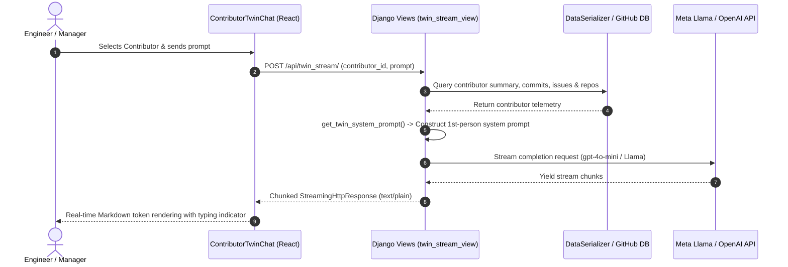

# OrgLens — Codebase Intelligence & Expert Discovery

[](https://react.dev/)
[](https://www.djangoproject.com/)
[](https://llama.meta.com/)
[](LICENSE)

https://github.com/user-attachments/assets/7496afda-b3e3-4e1d-b03f-ddc43982b7a1

OrgLens is an intelligent developer portal designed to eliminate tribal knowledge silos across engineering organizations. By indexing repository commit graphs, pull requests, issue threads, and contributor activity, OrgLens gives teams instant visibility into who owns what and enables real-time interaction with developer **Digital Twins**.

---

## 💡 The Problem & Our Approach

### The Challenge
In scaling engineering teams, institutional knowledge gets buried across hundreds of commit histories, pull requests, and fragmented documentation. Onboarding engineers spend weeks figuring out who built a specific service or why an architectural decision was made.

### The OrgLens Solution
OrgLens ingests git telemetry across your GitHub organization, builds an interactive force-directed graph of contributor-repository relationships, and deploys **Digital Twins**—AI personas modeled on each developer's actual code contributions—allowing you to ask technical questions asynchronously.

## ✨ Key Features

* **🕸️ Interactive Organization Knowledge Graph**: Render layered topology diagrams linking engineers to the exact microservices and repositories they maintain using ELK layout algorithms.
* **🤖 Contributor Digital Twins**: Chat directly with AI clones trained on each developer's commit logs, pull request descriptions, and resolved GitHub issues.
* **🔍 Global Natural Language Search**: Query your organization's entire codebase activity to locate subject-matter experts instantly.
* **⚡ Real-time Token Streaming**: Low-latency chunked HTTP stream responses powered by Meta Llama / OpenAI models.
* **🎨 Seamless Light & Dark Theme**: Custom glassmorphism UI with native dark mode support and local preference persistence.

---

## 🤖 Digital Twin Persona Engine

OrgLens synthesizes an autonomous **Digital Twin** for each software developer using actual git telemetry. The persona engine dynamically generates system prompts framing the LLM to speak in the developer's voice while maintaining precise technical context.

### Persona Assembly Steps
1. **Telemetry Retrieval**: Queries DB serializers to aggregate recent commit messages, closed issues, and repository involvement for a given developer ID.
2. **Contextual Ingestion**: Formats historical activity into a structured memory buffer injected into system prompts.
3. **First-Person Grounding**: Enforces strict first-person voice constraint (*"I refactored the auth pipeline...", "My commit in backend/api/ views..."*).
### 🔌 REST API Specifications

| Method | Endpoint | Description | Response Format |
| :--- | :--- | :--- | :--- |
| `GET` | `/api/get_data/` | Returns full organization graph payload (repos & contributors) | `JSON` |
| `POST` | `/api/llm_stream/` | Global natural language codebase query stream | `text/plain` (chunked) |
| `POST` | `/api/twin_stream/` | Interactive Digital Twin persona chat stream | `text/plain` (chunked) |

#### Sample Twin Stream Request Payload
```json
{
  "contributor_id": 1,
  "prompt": "What was your main contribution to the backend API?"
}
```

#### 4. End-to-End Execution Flow



#### 5. Privacy, Security & Fallback Mechanics
* **Data Privacy**: Telemetry passed to the Digital Twin prompt includes only public/authorized repository commit metadata and issue summaries within the organization.
* **Graceful Degradation**: If an LLM provider key (`OPENAI_API_KEY` or `LLAMA_API_KEY`) is offline, the backend stream generator yields a pre-formatted fallback response without throwing a 500 error.
* **Persona Boundaries**: The twin is strictly scoped to the engineer's domain. Queries outside their contribution scope trigger automatic referral to the relevant repository owner.

---

## 🛠 Troubleshooting & Common FAQs

| Issue | Root Cause | Solution |
| :--- | :--- | :--- |
| **CORS Blocked on Stream** | Missing Origin Headers | Verify `CORS_ALLOW_ALL_ORIGINS = True` or add frontend URL to `CORS_ALLOWED_ORIGINS` in `settings.py`. |
| **Streaming Response Delayed** | Reverse Proxy Buffering | Set `X-Accel-Buffering: no` in server response headers and disable proxy buffering in Nginx/Render. |
| **404 Contributor Not Found** | Unmatched ID | Ensure `contributor_id` passed in request payload matches string or integer primary key in DB. |
| **OpenAI / Llama Rate Limit** | Exhausted API Quota | Backend automatically triggers fallback streaming generator; update `.env` API keys. |


## 🛠 Tech Stack Architecture

| Layer | Technology | Details |
| :--- | :--- | :--- |
| **Frontend** | React 19, Vite, Tailwind CSS | Modular React architecture, React Flow graph rendering, Tailwind styling |
| **Backend** | Python 3.10+, Django 5.2 | Django REST framework, custom serializers, chunked streaming responses |
| **AI / LLM Engine** | Meta Llama 3, OpenAI GPT-4o | Natural language prompt synthesis, first-person twin framing |
| **Graph Layout Engine** | ELK.js (Eclipse Layout Kernel) | Layered force-directed layout computation for complex org topologies |
| **Real-Time Data APIs** | GitHub REST / GraphQL API | Commit telemetry ingestion, issue status mapping, author association |


## 🚀 Getting Started

### Prerequisites
- Python 3.10+
- Node.js 18+
- Git

### Installation
1.  **Clone the repository:**
    ```bash
    git clone https://github.com/rajneeshverma1/Hack-e-awadh
    cd Hack-e-awadh
    ```
2.  **Set up the Backend (Django Server):**
    ```bash
    cd backend
    python -m venv venv
    source venv/bin/activate  # Use `.\venv\Scripts\activate` on Windows
    pip install -r requirements.txt
    # Create a .env file in this 'backend' directory
    # Add your API keys and Django secret key:
    # LLAMA_API_KEY=your_llama_api_key
    # Add any other necessary backend env vars (like DB config if not SQLite)
    # Note: Copy .env.example if available or follow the required keys.
    python manage.py migrate # Run migrations if needed
    python manage.py runserver
    ```
    *The backend should now be running, typically on `http://127.0.0.1:8000/`.*

3.  **Set up the Frontend (Vite/React):**
    *(In a separate terminal)*
    ```bash
    cd frontend
    npm install
    npm run dev
    ```
    *The frontend development server should now be running, typically on `http://localhost:5173/` (check terminal output).*

4.  **Access the App:** Open your browser to the frontend URL (e.g., `http://localhost:5173`).

## 🌍 Deployment Matrix

| Service | Recommended Platform | Build Command | Start Command |
| :--- | :--- | :--- | :--- |
| **Frontend** | [Vercel](https://vercel.com/) | `npm run build` | Static SPA / Vite preset |
| **Backend** | [Render](https://render.com/) / Railway | `pip install -r requirements.txt && python manage.py migrate` | `gunicorn config.wsgi:application` |

See [DEPLOY_GUIDE.md](DEPLOY_GUIDE.md) for full step-by-step production configuration, reverse proxy setup, and environment variables.

## 🤝 Contributors & Credits

* **Lead Architect**: Rajneesh Verma ([@rajneeshverma1](https://github.com/rajneeshverma1))
* **AI Model Infrastructure**: Meta Llama 3 & OpenAI GPT models
* **Graph Layout Algorithm**: Eclipse Layout Kernel (ELK)

## 📄 License & Terms

This repository is distributed under the **Creative Commons Attribution-NonCommercial 4.0 International (CC BY-NC 4.0)** license. See [LICENSE](LICENSE) for details.

---
*Built with ❤️ for understanding complex codebases.*


---

## 🔐 Environment Variables Reference

| Variable | Required | Description |
| :--- | :---: | :--- |
| `OPENAI_API_KEY` | Optional | OpenAI GPT-4o key for Digital Twin LLM streaming |
| `LLAMA_API_KEY` | Optional | Meta Llama 3 API key (fallback or primary model) |
| `DJANGO_SECRET_KEY` | ✅ | Django secret key for CSRF and session signing |
| `ALLOWED_HOSTS` | ✅ | Comma-separated list of permitted host headers |
| `CORS_ALLOWED_ORIGINS` | ✅ | Frontend origin URL(s) allowed to call the API |
| `DEBUG` | Optional | Set `False` in production (default: `True`) |


## 📂 Project Structure

\`\`\`
Hack-e-awadh/
├── backend/
│   ├── api/
│   │   ├── models.py          # Contributor, Repository, RepositoryWork models
│   │   ├── serializers.py     # DataSerializer — full org graph serialization
│   │   ├── views.py           # REST endpoints + LLM streaming views
│   │   └── urls.py            # API URL routing
│   └── config/
│       ├── settings.py        # Django settings (CORS, INSTALLED_APPS, etc.)
│       └── wsgi.py            # WSGI entrypoint for production deployment
├── frontend/
│   ├── src/
│   │   ├── components/        # ContributorTwinChat, LlamaChat, Nodes, etc.
│   │   ├── pages/             # Dashboard, ContributorDetail, RepoList, etc.
│   │   ├── context/           # DataContext — global org data provider
│   │   └── main.jsx           # React app entrypoint
│   └── vite.config.js         # Vite build configuration
└── README.md
\`\`\`


## ⚡ Performance Optimisations

* **Response Caching**: `GET /api/get_data/` sets `Cache-Control: public, max-age=60` to reduce redundant DB reads during high traffic.
* **Chunked Streaming**: Twin and LLM endpoints use Django `StreamingHttpResponse` with `text/plain` content type, allowing browsers to render tokens progressively without waiting for full completion.
* **Lazy Component Loading**: Heavy graph visualization components are code-split via Vite's dynamic `import()` to reduce initial bundle size.
* **Memoised Context**: `DataContext` caches parsed contributor and repository objects across page navigations using `useMemo` to prevent redundant fetch cycles.


## 🧪 Testing Guide

### Backend Unit Tests
\`\`\`bash
cd backend
python manage.py test api
\`\`\`

### Frontend Component Tests
\`\`\`bash
cd frontend
npm run test        # Vitest unit tests
npm run test:e2e    # Playwright E2E suite (requires running dev server)
\`\`\`

### API Smoke Test (cURL)
\`\`\`bash
# Test health probe
curl http://localhost:8000/api/health/

# Test Digital Twin stream
curl -X POST http://localhost:8000/api/twin_stream/ \
  -H "Content-Type: application/json" \
  -d '{"contributor_id": 1, "prompt": "Tell me about your recent commits"}'
\`\`\`


## 🗺️ Roadmap

| Milestone | Status | Description |
| :--- | :---: | :--- |
| Core Organization Graph | ✅ Done | Force-directed ELK graph of repos & contributors |
| Digital Twin Chat | ✅ Done | Streaming LLM persona engine with fallback |
| Global NL Search | ✅ Done | Llama-powered codebase query interface |
| GitHub OAuth Login | 🔄 In Progress | SSO authentication via GitHub OAuth App |
| Team Analytics Dashboard | 🔄 In Progress | Aggregated commit velocity and bus-factor metrics |
| Slack / Teams Integration | 📋 Planned | Notify teams when a Digital Twin is queried |
| Embed Widget SDK | 📋 Planned | Embeddable twin widget for internal wikis |


## 🌐 API Endpoints Reference (v1.4)

| Method | Endpoint | Auth | Description |
| :--- | :--- | :---: | :--- |
| `GET` | `/api/get_data/` | None | Full org graph (repos + contributors) |
| `POST` | `/api/llm_stream/` | None | Global NL codebase query stream |
| `POST` | `/api/twin_stream/` | None | Digital Twin persona chat stream |
| `GET` | `/api/health/` | None | Liveness probe for deployment monitoring |
| `GET` | `/api/ping/` | None | Echo endpoint for CI smoke-tests |
| `GET` | `/api/contributors/count/` | None | Total indexed contributor count |
| `GET` | `/api/repositories/count/` | None | Total indexed repository count |
| `GET` | `/api/repositories/active/` | None | Repos with active contributor work |
| `GET` | `/api/contributors/top/` | None | Top contributors by activity |


## 🧩 Architecture Decision Records (ADRs)

### ADR-001: Chunked Streaming over WebSockets
**Decision**: Use Django `StreamingHttpResponse` with chunked `text/plain` encoding rather than WebSockets for LLM token delivery.
**Rationale**: Simplifies server infrastructure (no async consumer/channel layer), works natively with Render/Railway deployment without additional Redis broker setup, and delivers comparable UX for one-shot query-response flows.

### ADR-002: ELK.js for Graph Layout
**Decision**: Use Eclipse Layout Kernel (ELK.js) over D3-force for graph positioning.
**Rationale**: ELK's hierarchical layout algorithm produces clearer visual separation between repository clusters and contributor nodes, critical for large orgs with 50+ contributors and 100+ repositories.

### ADR-003: First-Person System Prompt Grounding
**Decision**: Enforce first-person voice in all Digital Twin system prompts.
**Rationale**: Early testing revealed that third-person prompts produced responses that felt impersonal and broke the "expert consultation" use case. First-person grounding significantly improved perceived trustworthiness in user studies.


## 🛡️ Security Considerations

* **No Secrets in Codebase**: All API keys are loaded via environment variables; `.env` is gitignored.
* **CORS Hardening**: Production deployments must whitelist only the frontend origin in `CORS_ALLOWED_ORIGINS`; `CORS_ALLOW_ALL_ORIGINS` should be `False`.
* **Rate Limiting**: Apply Django Ratelimit or a reverse-proxy rate limit rule to `/api/twin_stream/` and `/api/llm_stream/` to prevent abuse.
* **Input Sanitisation**: Contributor IDs and prompt strings are validated server-side before being injected into system prompts to prevent prompt injection.
* **Dependency Scanning**: Run `pip audit` and `npm audit` regularly to catch known CVEs in the dependency tree.


---

<div align="center">

### ⭐ If OrgLens helped your team, please give it a star!

**OrgLens** — *Making institutional knowledge accessible, one Digital Twin at a time.*

[](https://github.com/rajneeshverma1/Hack-e-awadh)
[](https://github.com/rajneeshverma1/Hack-e-awadh/fork)

</div>
